# Project Walkthrough Document
This guide offers a comprehensive tour of the Conversation Analyzer application, covering every
page in detail. Accompanied by screenshots and thorough explanations, it ensures you gain a full
understanding of each page's functionality.

## Login Page
Upon launching the application in your browser, you'll be greeted by the login page. Here, users
with existing credentials can sign in directly. If you're new to the application, you can request
access by navigating to the registration page.

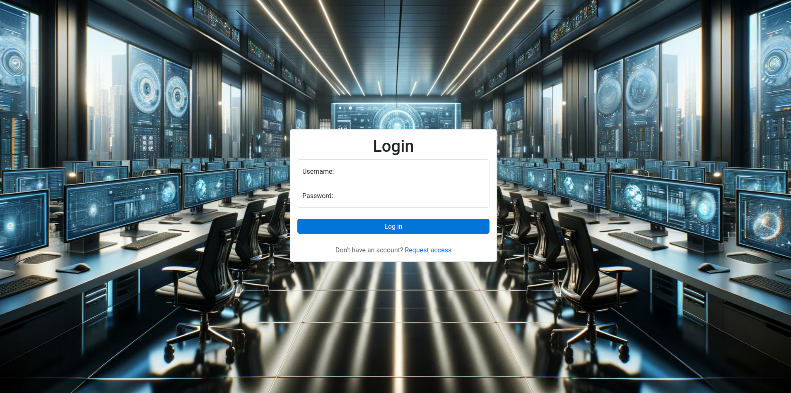

## Register Account Page
Should you need to create an account, this page facilitates the registration process. After
registration, accounts remain inactive pending administrative approval. This step is taken through
the admin panel, ensuring that only authorised users gain access, thereby safeguarding the system
against unauthorised entry.

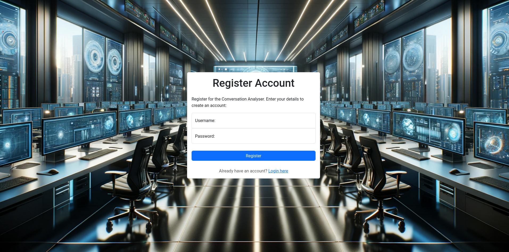

## Dashboard Page
The dashboard page offers a high-level overview of the application and analysis of uploaded
documents at a glance. It allows you to select documents for analysis and presents various
insightful graphs, each accompanied by detailed explanations for your convenience. Additionally,
it features a section for recently viewed documents and profiles, enabling swift navigation to
related pages.

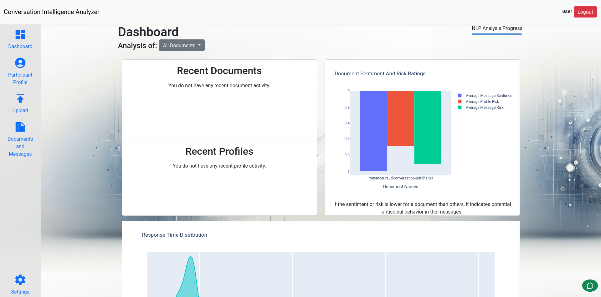

## Upload File Page
This page enables you to upload both structured and unstructured data for parsing. The system
automatically identifies and maps key fields such as the message title, sender, timestamp, and body.
Should the automatic mapping not align perfectly, you're provided the option to manually remap these
fields to ensure accuracy. For unstructured data, the system uses OpenAI's capabilities for
efficient formatting.

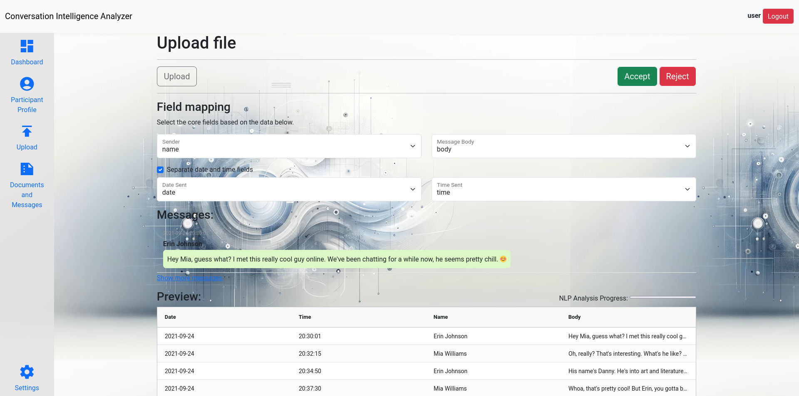

## Messages View
The Messages View serves as the hub for document and message analysis, offering tools for deep
insights. Leverage data refined by OpenAI, or utilise the in-line analysis from the NLP for nuanced
understanding. For interactive analysis, engage with the system through the chatbox located at the
bottom-right corner of your screen. Additionally, manage your uploads via the 'My Documents' side
panel, which displays all files you've uploaded, allowing for simple file deletion and organisation. 

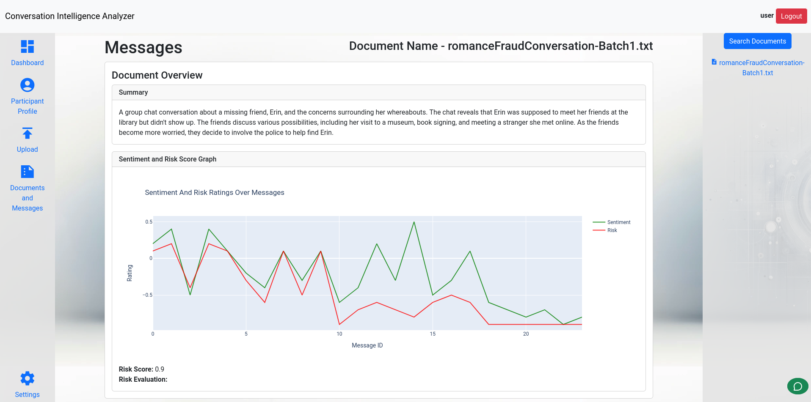
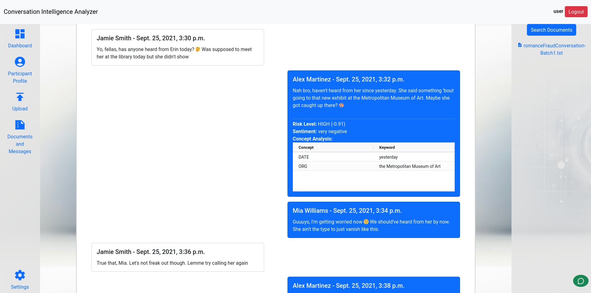
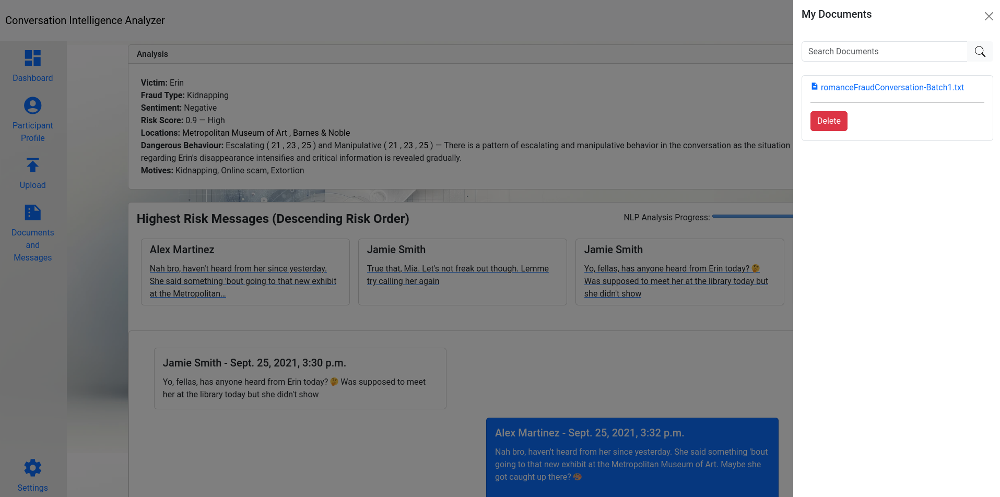

## Participant Profile Page
The Participant Profile Page offers a detailed overview of actors identified through document
analysis, showcasing their respective risk scores through bullet and line graphs. It also includes
insights into their last activity, relevant notes, and the associated datasets, facilitating
individual analysis and streamlined navigation. Moreover, the profile search bar allows for quick
searching of specific profiles, while also presenting related profiles—highlighting connections
based on previous interactions.

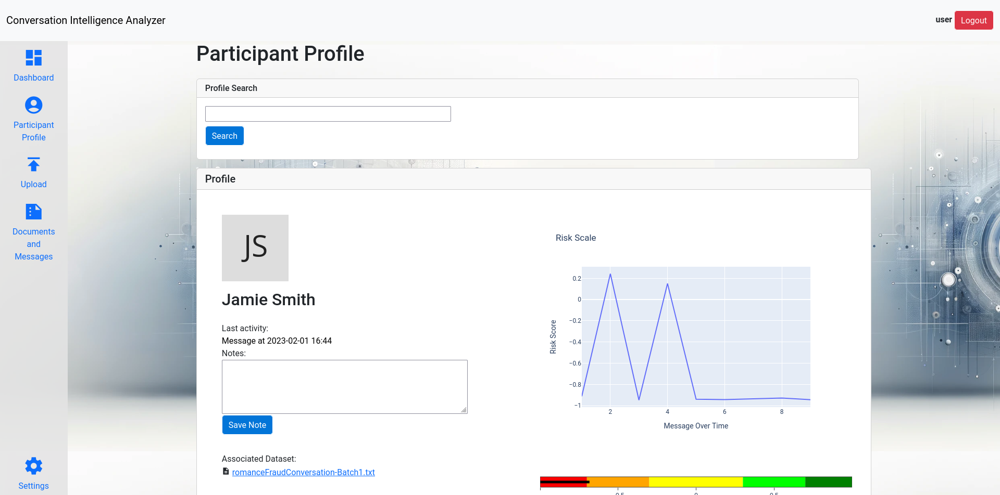
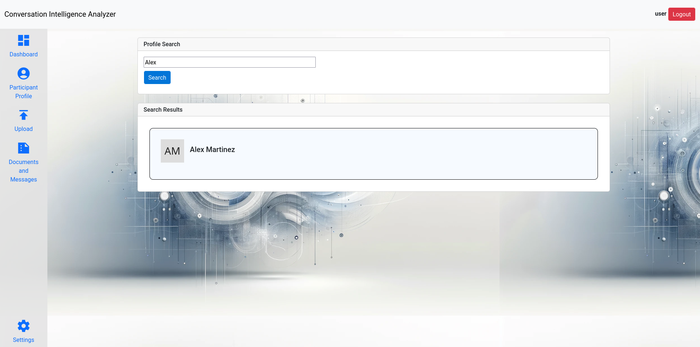
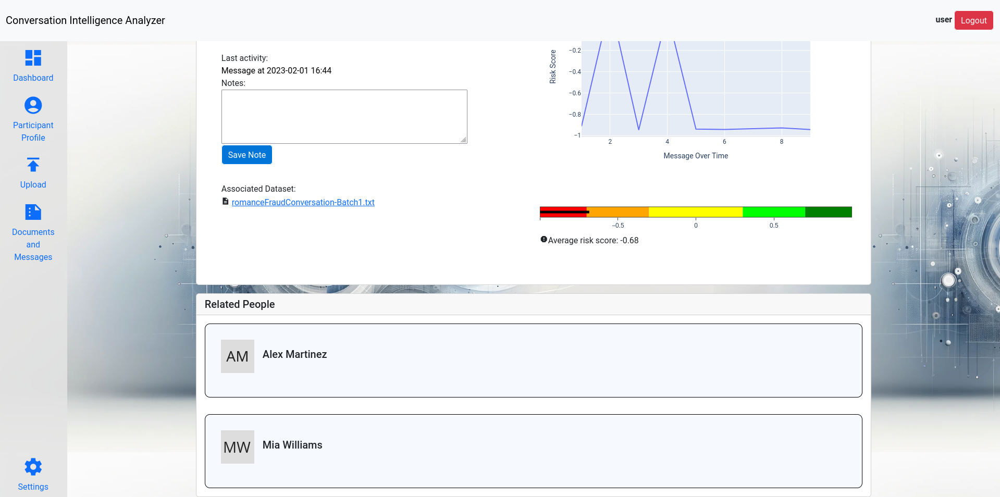

## Settings Page
On the Settings Page, you have the control to manage your preferences, including the ability to
enable or disable recent query tracking for improved privacy. Additionally, it offers the option to
change your password, ensuring your account's security is always up to date.

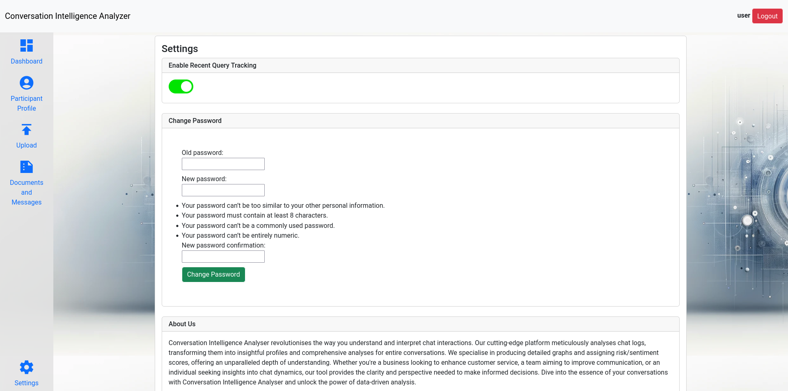

## Chatbot
Accessible from both the Dashboard and Messages View pages, the chatbot feature is positioned at
the bottom right of your screen, designed to create an interactive experience. You can engage with
the chatbot to discuss and analyse documents in further depth. This tool extends beyond the
capabilities of the Messages View page, offering additional insights and facilitating a more
comprehensive analysis.

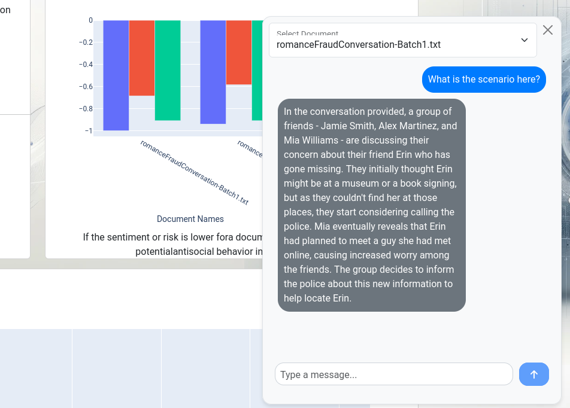